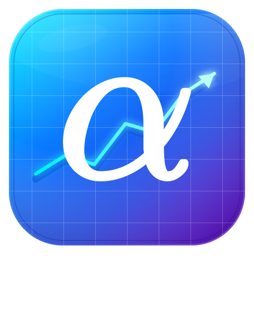
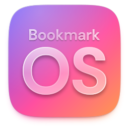

## Selected Work

### &ensp;[AlphaVerify — Trading-Signal Validation Framework](https://github.com/doubletrends/alpha-verify)
Checks whether trading signals actually work. It measures how often price moves ±X% within N days under each indicator condition, then compares that against 1,000 simulated random markets. On NASDAQ, 25 of 552 conditions passed. Pure chance would give you 27.6.

### &ensp;[Minecraft CityGen — Customizable AI City Generator](https://github.com/chengmarc/minecraft-citygen)
Turns your own Minecraft builds into a whole city. You mark buildings in-game with a few special blocks, the app lays out roads and places buildings from a seed, then writes the city back into a playable world. Windows app with an installer.

### &ensp;[WeChat Skill — Agentic AI Plugin](https://github.com/chengmarc/wechat-to-ai)
A Claude Code plugin that exports your WeChat history for AI to read. It reads from the local databases on your own machine and turns private and group chats into plain text an LLM can work with. Nothing leaves your computer.

### &ensp;[Bookmark OS — Desktop Experience in your Browser](https://github.com/chengmarc/chengmarc.github.io)
Your bookmarks as a desktop that opens in any browser, with no account to log in to. Desktop icons, a dock and a searchable bookmark window, all on one static page with no framework and no build step. Rearrange it, export the layout, and every browser starts from it.

### &ensp;[GPT-2 from Scratch](https://github.com/chengmarc/GPT-replication)
GPT-2 (162M parameters) written from scratch in PyTorch. Each part is its own module: tokenizer, attention, layer norm, feed-forward, training loop. Trained on the Harry Potter books.

### &ensp;[PaySim Fraud Detection Data Warehouse](https://github.com/chengmarc/paysim-dw)
A fraud-analytics data warehouse on Hadoop, Hive and PySpark. It loads 6.36M transactions through three layers (raw, cleaned, reporting) and produces fraud rates by transaction type and a list of high-risk accounts.

## Technical Stack

<table>
<tr><td>Machine Learning</td><td>

 
 
 
 

</td></tr>
<tr><td>Data Science</td><td>

 
 

 

</td></tr>
<tr><td>Big Data</td><td>

 
 

</td></tr>
<tr><td>Client-side</td><td>

 
 
 
 

</td></tr>
<tr><td>Server-side</td><td>

 
 
 

</td></tr>
<tr><td>Package Management</td><td>

 
 
 

</td></tr>
<tr><td>CLI & Markups</td><td>

 
 
 

</td></tr>
</table>

**Favorite Editors:** Notepad++, VS Code
